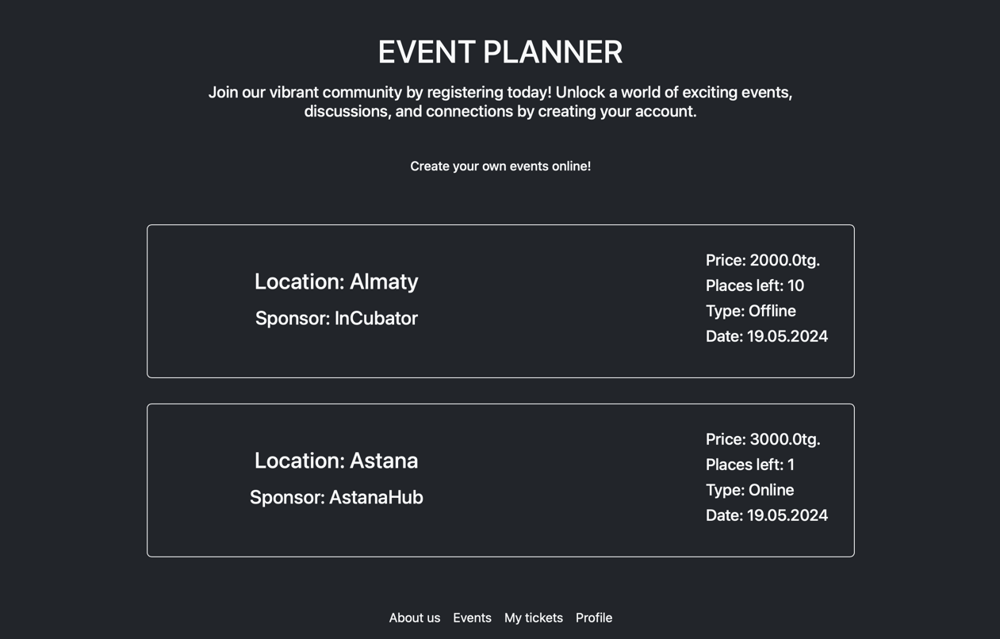
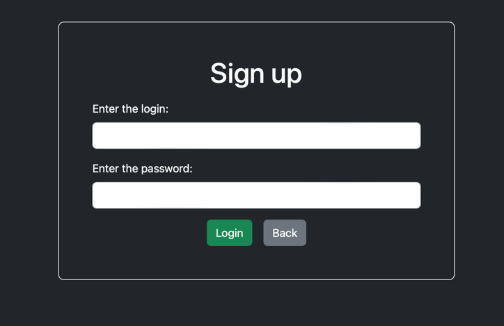
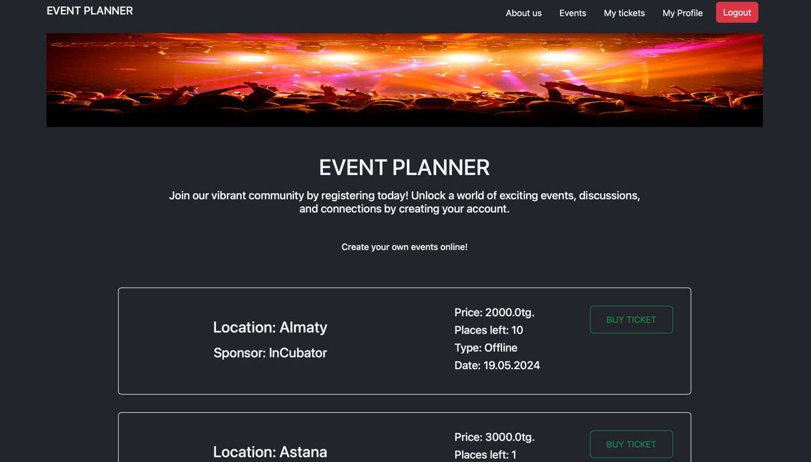
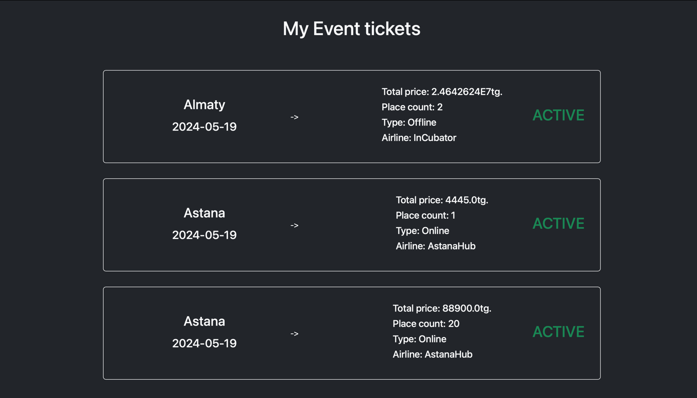
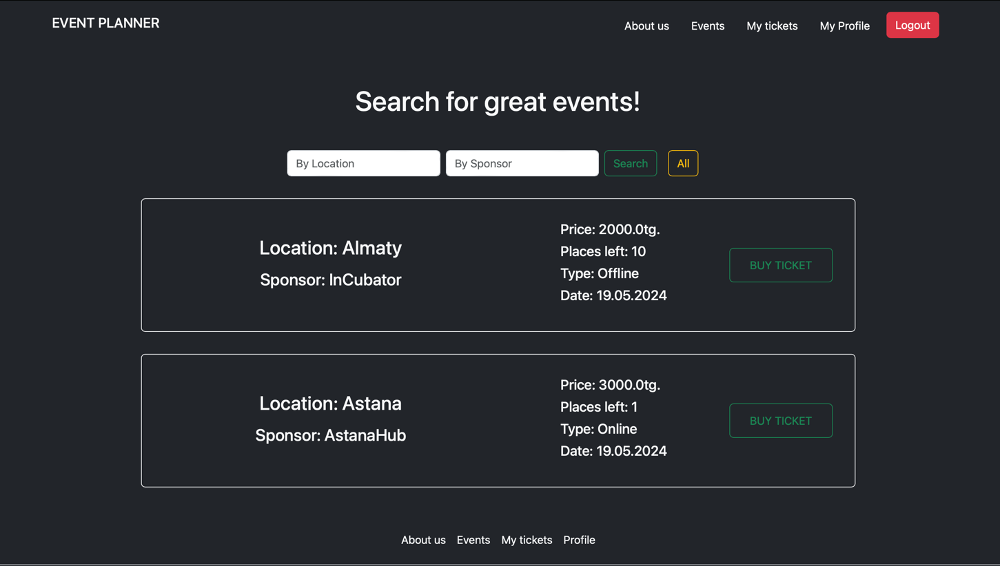

# Event Planner MVC

Как запсутить
Соберите проект:
mvn clean package

Постройте и запустите контейнеры:
docker-compose up --build

Убедитесь что все пароль и порты правильные

Преокт написан на frameworke Spring MVC использует паттер model view controller, для фронт части thymeleaf html, bootstrap.
На трехслойной архитектуре Model Service Reposity.
Все опрерации с базой данных с помощью Spring JPA. База postgreSQL.

Сайт создан для просмотра и покупки билета на мероприятие.
При входе сразу можно видеть Мероприятии но нельзя купить билет для них.
Есть Админская панель где и создаются все мероприятии. Есть множество ограничение для юзера такие как нельяз пустые строки отправлять
или как нельяз выбрать дату которая уже прошла.

docker_compose.yaml автоматический запускает скрипт который создает админ юзера
login: admin
pass: 123
ADMIN PANEL

Дальше зайдя обычным юзером можно будет купить билет на мероприятие, билеты ограничены, если дата мероприятие уже прошла то статус меняется на прошедший
и недоступен для покупки. Можно зайти MyTickets и увидеть все билеты на мероприятия.

Есть функционал для редактированию своего профиля.

